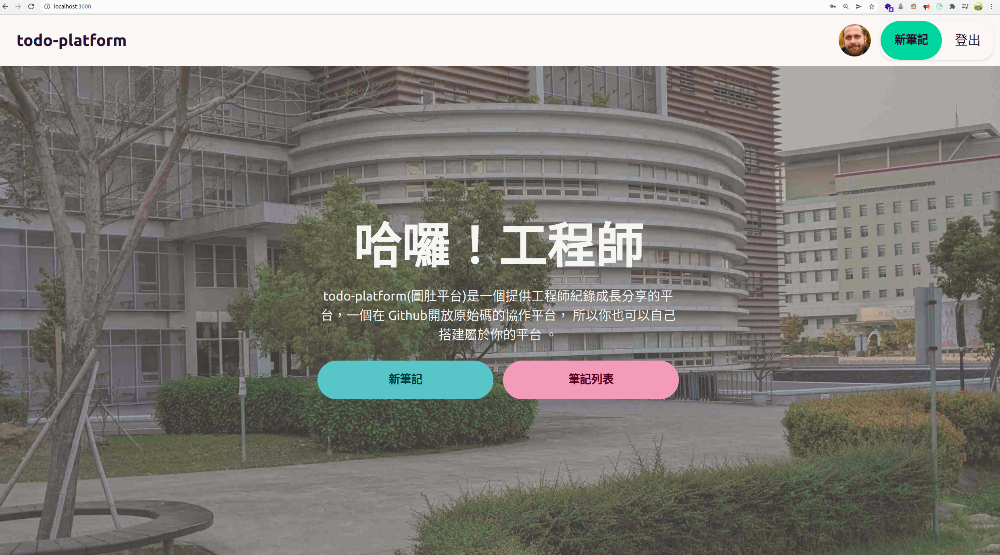
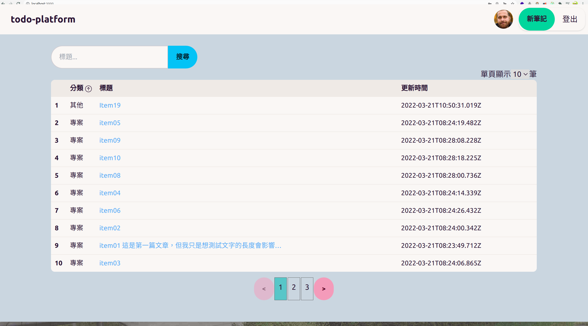
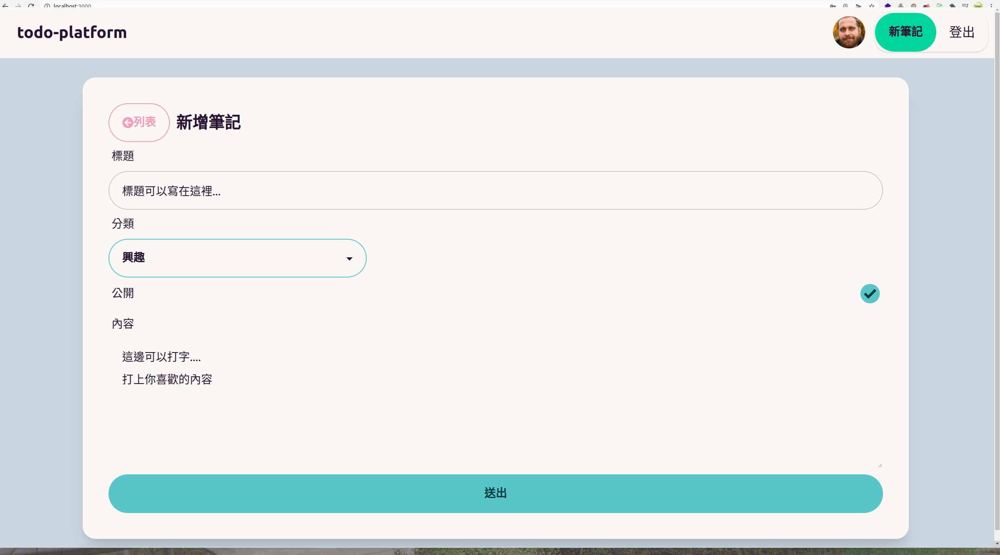

# 專案說明
這是使用MERN Stack的網頁專案，概要:
1. Express.js和MongoDB作為後台提供REST API
2. ReactJS搭配Redux toolkit作為前端
3. 內含帳號註冊登入、列表查詢、頁面編輯等常見功能

# 預覽畫面





# 環境建置
```bash
# 複製todo-platform的儲存庫
 $ git clone https://github.com/kabuto412rock/todo-platform.git

# 進入儲存庫內的資料夾
$ cd todo-platform 

# .env 儲存環境變數的檔案
(todo-platform) $ touch .nev
```
接著在.env檔案裡面放入對應的環境變數(4個):
```bash
# .env
# 建置環境, NODE_ENV = {開發環境}
NODE_ENV = development
# 後端的連線PORT, PORT=5000
PORT = 5000
# 連線到MongoDB的連結, MONGO_URI= {MONGODB連線的網址} 
MONGO_URI = mongodb+srv....
# JWT Toekn的加密參數, JWT_SECRET = {加密參數}
JWT_SECRET = thisisSecret
```

建好環境變數後，安裝前後端的依賴函式庫:
```bash
# 最外層目錄./todo-platform 執行後端環境初始化
(todo-platform) $ yarn  

# 進入前端目錄frontend 執行前端環境初始化
(todo-platform/frontend) $ cd frontend
(todo-platform/frontend) $ yarn  

# 回到todo-platform目錄底下開始執行系統
(todo-platform/frontend) $ cd ..
(todo-platform) $ npm run dev
```

如果本地端沒有MongoDB可以前往[MongoDB官網](https://cloud.mongodb.com/)申請一個開發用的免費Server去連線，


TODO: 筆記note列表(查詢、分頁)
TODO: 編輯note

### 版本0.2.0 [前端]
1. 前端環境建置(CRA,TailwindCSS,Rect-Router...)
2. 使用者登入會產生一個30天的jwt token，儲存在localStorage裡面用來後續驗證
3. 使用者註冊(註冊後會自動登入)

### 版本0.1.0 [後端]
1. 使用者登入、註冊需要的後端API
2. 建立MongoDB連線的設定
3. 建立Mongo